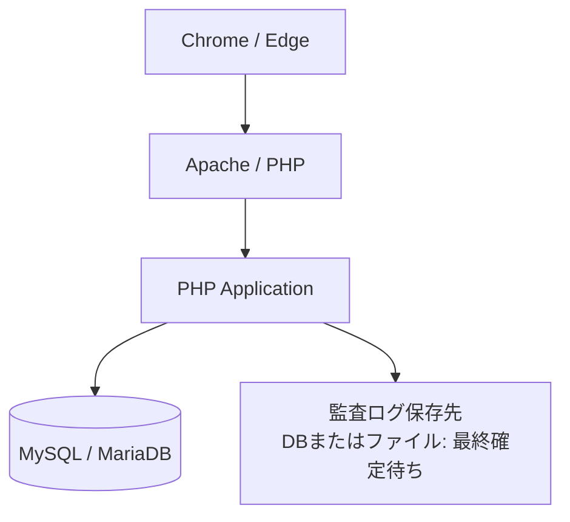
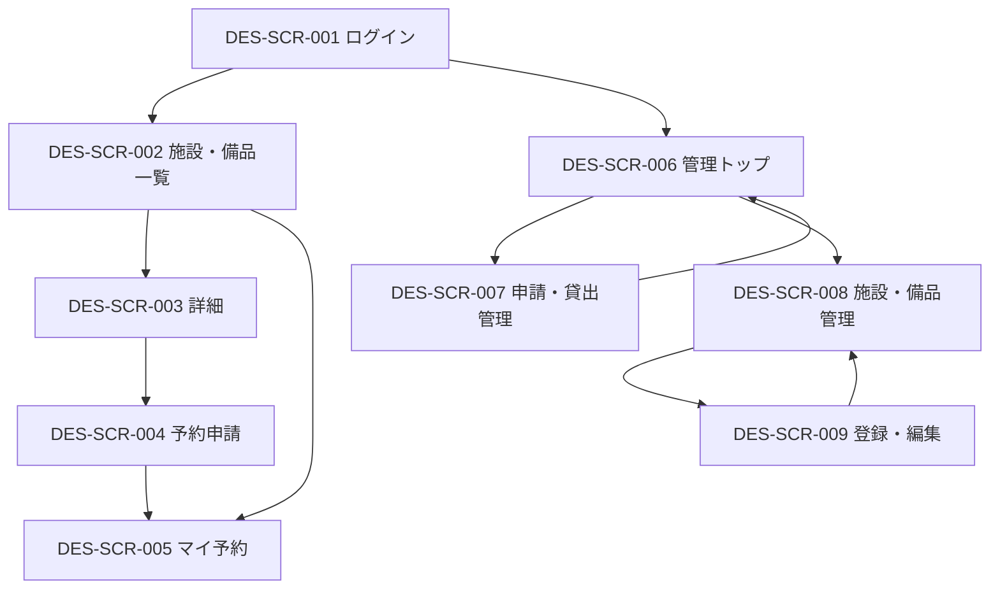
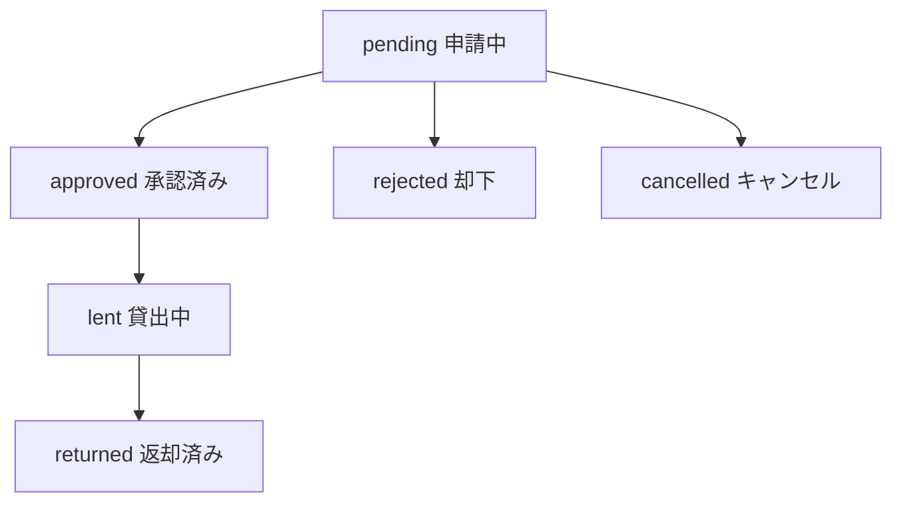
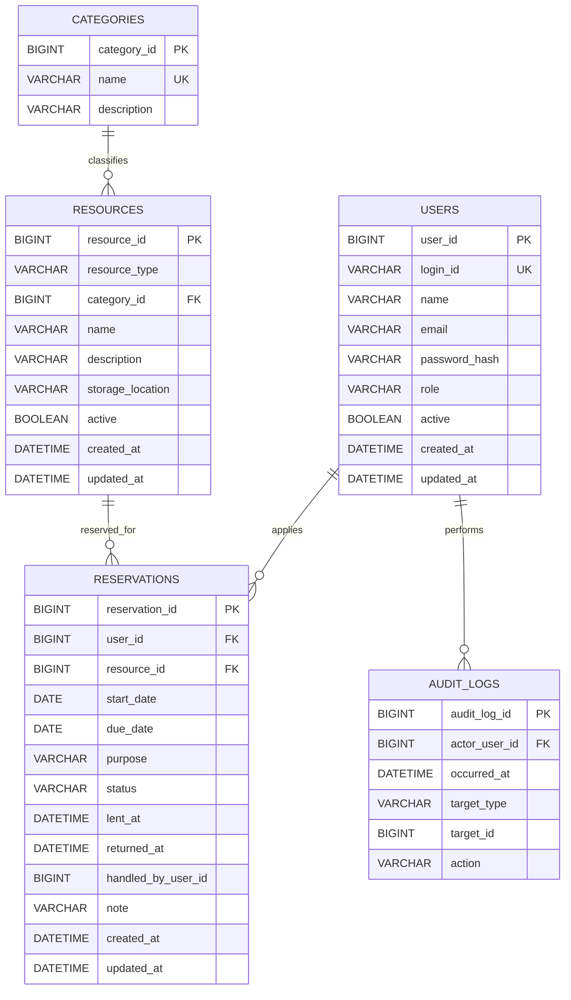

# 学内施設・備品予約貸出管理システム
# セキュリティ強化型詳細設計書（初版）

- 文書ID: DES-001
- 版: 第1版
- 対象: 前半セット第1回〜第7回 MVP
- 開発環境: PHP / MySQL・MariaDB（XAMPP）/ HTML / CSS / JavaScript / Git / GitHub / VSCode
- 参照文書:
  - 学内施設・備品予約貸出管理システム 要望書
  - `01_proposal.md`
  - `02_requirement_definition.md`
  - `02_requirement_definition_final.md`（セキュリティ監査反映版）

---

## 0. 本書の位置づけ

本書は、原本要望書、初回提案書、要件定義書、セキュリティ監査の最終合意事項を統合し、
第7回までのMVP実装を開始するための「初版詳細設計」とする。

本書では次の方針を採る。

1. 要件定義で確定済みの事項は設計へ具体化する。
2. SQLインジェクション、XSS、CSRF、Session Fixation、IDOR、エラー情報漏えい対策をMVP必須として実装設計へ反映する。
3. 詳細設計で未決とされた事項は、実装開始に必要な範囲だけ「初版案」を示し、無理に確定しない。
4. 要件の意味を変更する設計追加は、元REQ IDと理由を明記する。
5. 画面・処理・テーブル・共通部品にはDES IDを付与し、REQ→DESの追跡を可能にする。

---

# 1. 設計方針

## 1.1 MVPの基本フロー

一般利用者:

`ログイン → 施設・備品を探す → 詳細確認 → 予約申請 → 自分の予約状況確認 → 必要に応じて申請中キャンセル`

管理担当者:

`ログイン → 申請確認 → 承認/却下 → 貸出処理 → 返却処理 → 施設・備品管理`

対応要件:
- REQ-F-001〜014
- REQ-NF-001〜018

## 1.2 セキュリティ実装原則

| 項目 | 設計方針 | 対応REQ |
|---|---|---|
| SQLインジェクション | PDO + プリペアドステートメント。値のSQL文字列連結禁止。ORDER BY等の構造値はホワイトリスト | REQ-NF-003 |
| XSS | HTML出力時に共通関数 `e()` で `htmlspecialchars(..., ENT_QUOTES, 'UTF-8')` | REQ-NF-009 |
| CSRF | 状態変更はPOSTのみ。セッション内トークンとPOSTトークンを `hash_equals()` で照合 | REQ-NF-011 |
| セッション固定攻撃 | ログイン成功時 `session_regenerate_id(true)` | REQ-F-001, REQ-NF-010 |
| セッションCookie | `HttpOnly=true`, `SameSite=Lax`, HTTPS時 `Secure=true` | REQ-NF-010 |
| 無操作失効 | 最終操作から30分でセッション破棄し再ログイン | REQ-NF-010 |
| IDOR | URL/POSTのIDだけで認可しない。本人ID・権限はセッションから取得 | REQ-NF-002, REQ-F-008, REQ-F-010 |
| パスワード | `password_hash()` / `password_verify()`、DB列は `VARCHAR(255)` | REQ-NF-001 |
| DB例外 | 画面には一般化メッセージ。SQL文・接続情報・スタックトレースは非表示 | REQ-NF-012 |
| 監査 | 重要操作を `writeAuditLog()` 経由で記録 | REQ-NF-015 |
| 二重送信 | POST → Redirect → GET（PRG） | REQ-F-005〜013 |
| DB整合性 | 複数更新・承認処理はトランザクション | REQ-F-009, REQ-NF-003 |
| セキュリティヘッダー | 共通処理で `X-Content-Type-Options: nosniff`、`X-Frame-Options: DENY` | REQ-NF-018 |

---

# 2. システム構成

## 2.1 論理構成



## 2.2 アプリケーション責務

| 層 | 主な責務 |
|---|---|
| `public/` | ブラウザから直接アクセスする入口 |
| `app/controllers/` | リクエスト受付、認証・認可、入力検証、サービス呼び出し |
| `app/services/` | 予約承認、重複判定、貸出返却等の業務処理 |
| `app/repositories/` | PDOによるDBアクセス |
| `app/views/` | HTML表示。出力時エスケープ必須 |
| `app/security/` | CSRF、セッション、認可、XSS出力、ヘッダー等の共通処理 |
| `config/` | DB設定・アプリ設定。公開領域外、秘密情報はGit管理外 |
| `storage/` | ログ等。公開領域外 |
| `database/` | DDL・初期データ・テストデータ |

---

# 3. ディレクトリ・ファイル構成

対応REQ:
REQ-NF-002, 003, 009, 010, 011, 012, 014, 015, 017, 018

```text
campus-reservation/
├── public/
│   ├── index.php
│   ├── login.php
│   ├── logout.php
│   ├── resources/
│   │   ├── index.php
│   │   └── detail.php
│   ├── reservations/
│   │   ├── create.php
│   │   ├── my.php
│   │   └── cancel.php
│   ├── admin/
│   │   ├── index.php
│   │   ├── reservations/
│   │   │   ├── index.php
│   │   │   ├── approve.php
│   │   │   ├── reject.php
│   │   │   ├── lend.php
│   │   │   └── return.php
│   │   └── resources/
│   │       ├── index.php
│   │       ├── create.php
│   │       ├── edit.php
│   │       └── stop.php
│   └── assets/
│       ├── css/
│       │   └── app.css
│       └── js/
│           └── app.js
│
├── app/
│   ├── bootstrap.php
│   ├── controllers/
│   │   ├── AuthController.php
│   │   ├── ResourceController.php
│   │   ├── ReservationController.php
│   │   └── AdminController.php
│   ├── services/
│   │   ├── AuthService.php
│   │   ├── ReservationService.php
│   │   ├── ResourceService.php
│   │   └── AuditService.php
│   ├── repositories/
│   │   ├── UserRepository.php
│   │   ├── CategoryRepository.php
│   │   ├── ResourceRepository.php
│   │   ├── ReservationRepository.php
│   │   ├── AuditRepository.php
│   │   └── LoginAttemptRepository.php
│   ├── security/
│   │   ├── session.php
│   │   ├── auth.php
│   │   ├── csrf.php
│   │   ├── escape.php
│   │   ├── validation.php
│   │   └── headers.php
│   ├── views/
│   │   ├── layouts/
│   │   ├── auth/
│   │   ├── resources/
│   │   ├── reservations/
│   │   └── admin/
│   └── helpers/
│       └── redirect.php
│
├── config/
│   ├── app.php
│   ├── database.example.php
│   └── database.local.php
│
├── database/
│   ├── schema.sql
│   └── seed.sql
│
├── storage/
│   └── logs/
│       └── .gitkeep
│
├── tests/
│   ├── functional/
│   └── security/
│
├── .gitignore
└── README.md
```

### 3.1 直接アクセス禁止

- `config/`, `app/`, `storage/`, `database/` は `public/` の外に配置する。
- ApacheのDocumentRootは可能なら `public/` に向ける。
- XAMPP上で構成上困難な場合は、少なくとも `.htaccess` 等で内部ファイルへのHTTPアクセスを拒否する。

対応REQ: REQ-NF-014, REQ-NF-017

---

# 4. 画面設計

## 4.1 画面一覧

| DES ID | 画面 | 利用者 | 主な機能 | 対応REQ |
|---|---|---|---|---|
| DES-SCR-001 | ログイン | 全員 | 認証 | REQ-F-001, REQ-NF-001, 004, 010, 013 |
| DES-SCR-002 | 施設・備品一覧 | 一般/管理 | 一覧、簡易検索 | REQ-F-003, 004, REQ-NF-003, 007, 009 |
| DES-SCR-003 | 施設・備品詳細 | 一般/管理 | 詳細表示、予約導線 | REQ-F-014, REQ-NF-009 |
| DES-SCR-004 | 予約申請 | 一般/管理 | 期間・目的入力 | REQ-F-005, 009, REQ-NF-003, 011 |
| DES-SCR-005 | マイ予約 | 一般/管理 | 本人予約一覧、申請中キャンセル | REQ-F-008, 010, 011, REQ-NF-002, 011 |
| DES-SCR-006 | 管理トップ | 管理 | 管理機能への導線 | REQ-F-002, REQ-NF-002, 007 |
| DES-SCR-007 | 申請・貸出管理 | 管理 | 承認、却下、貸出、返却、期限超過表示 | REQ-F-006, 007, 009, 011, REQ-NF-011, 015 |
| DES-SCR-008 | 施設・備品管理 | 管理 | 一覧、登録、変更、利用停止 | REQ-F-012, 013, REQ-NF-002, 011, 015 |
| DES-SCR-009 | 施設・備品登録/編集 | 管理 | 入力、保存 | REQ-F-013, REQ-NF-003, 009, 011 |
| DES-SCR-010 | 共通エラー | 全員 | 一般化されたエラー案内 | REQ-NF-004, 012 |

## 4.2 画面遷移図



※ 権限のない利用者が管理URLへ直接アクセスした場合、画面非表示だけでなくサーバ側で拒否する。

## 4.3 DES-SCR-001 ログイン

入力:
- ログインID（学籍番号/職員番号またはメールアドレス。最終運用は未決）
- パスワード

表示:
- 認証失敗時: 「ログイン情報を確認してください」
- アカウントの存在有無は区別しない。

処理:
1. CSRFを検証する。
2. ログイン試行制限を確認する。
3. PDOプリペアドステートメントで利用者を検索する。
4. `password_verify()` で照合する。
5. 利用停止ユーザーは拒否する。
6. 成功時 `session_regenerate_id(true)`。
7. セッションへ `user_id`, `role`, `last_activity` を保存する。
8. 許可済みの遷移先へリダイレクトする。

対応:
- DES-PRC-001
- REQ-F-001
- REQ-NF-001, 002, 003, 004, 010, 011, 013

## 4.4 DES-SCR-002 施設・備品一覧

表示:
- 名称
- 分類
- 利用状態
- 詳細ボタン

検索:
- 名称: 部分一致
- 分類: 選択式
- SQLはプリペアドステートメント。
- 検索対象カラム名をクライアント値から直接SQLへ連結しない。

対応:
- DES-PRC-003
- REQ-F-003, 004
- REQ-NF-003, 007, 009

## 4.5 DES-SCR-003 施設・備品詳細

表示:
- 名称
- 分類
- 説明
- 保管場所
- 利用状態

制御:
- 利用停止中は予約申請ボタンを無効化し、サーバ側でも予約を拒否する。

対応:
- DES-PRC-004
- REQ-F-014, 005, 012
- REQ-NF-009

## 4.6 DES-SCR-004 予約申請

入力:
- 対象ID: hidden値を信用せずDBで存在・利用可否を再確認
- 利用開始日
- 返却予定日
- 利用目的

サーバ側検証:
- 必須
- 日付形式
- `利用開始日 <= 返却予定日`
- 対象存在
- 対象が利用可能
- 利用目的の文字数上限: **未決**
- 同一利用者・同一対象・同一期間の「申請中」多重登録拒否

登録時状態:
- `pending`（申請中）

対応:
- DES-PRC-005
- REQ-F-005, 009
- REQ-NF-003, 011

## 4.7 DES-SCR-005 マイ予約

表示:
- 本人の予約のみ
- 対象名
- 利用開始日
- 返却予定日
- 状態
- 返却期限超過表示
- 申請中のみ「キャンセル」ボタン

認可:
- `WHERE user_id = :session_user_id`
- POSTされたユーザーIDは使用しない。

対応:
- DES-PRC-008, DES-PRC-010
- REQ-F-008, 010, 011
- REQ-NF-002, 009, 011

## 4.8 DES-SCR-007 申請・貸出管理

表示:
- 申請中
- 承認済み
- 貸出中
- 返却済み
- 却下
- キャンセル
- 貸出中かつ返却予定日超過は「返却期限超過」

操作:
- pending → approved
- pending → rejected
- approved → lent
- lent → returned

定義外遷移は拒否する。

対応:
- DES-PRC-006, 007, 010, 011
- REQ-F-006, 007, 009, 011
- REQ-NF-002, 011, 015

## 4.9 DES-SCR-008 / 009 施設・備品管理

操作:
- 登録
- 変更
- 利用停止

更新可能項目:
- name
- category_id
- description
- storage_location
- active

サーバ側ホワイトリストにないPOST項目は更新しない。

利用停止:
- 承認済みまたは貸出中予約がある対象は利用停止不可。

対応:
- DES-PRC-009
- REQ-F-012, 013
- REQ-NF-002, 003, 011, 015

---

# 5. 処理設計

## 5.1 処理一覧

| DES ID | 処理 | 概要 | 対応REQ |
|---|---|---|---|
| DES-PRC-001 | ログイン認証 | パスワード照合、利用状態確認、セッション再生成 | REQ-F-001, REQ-NF-001, 010, 013 |
| DES-PRC-002 | ログアウト | セッション破棄、Cookie無効化 | REQ-F-001, REQ-NF-010 |
| DES-PRC-003 | 一覧・検索 | 施設・備品一覧、名称/分類検索 | REQ-F-003, 004, REQ-NF-003 |
| DES-PRC-004 | 詳細取得 | 対象ID検証、詳細取得 | REQ-F-014, REQ-NF-003 |
| DES-PRC-005 | 予約申請 | 入力検証、多重登録防止、登録 | REQ-F-005, 009, REQ-NF-003, 011 |
| DES-PRC-006 | 承認・却下 | 状態再確認、承認時重複再確認 | REQ-F-006, 009, REQ-NF-011, 015 |
| DES-PRC-007 | 貸出・返却 | 許可状態遷移のみ更新 | REQ-F-007, REQ-NF-011, 015 |
| DES-PRC-008 | 予約キャンセル | 本人かつpendingのみ | REQ-F-010, REQ-NF-002, 011, 015 |
| DES-PRC-009 | 施設・備品管理 | 登録/変更/利用停止、Mass Assignment対策 | REQ-F-012, 013, REQ-NF-002, 003, 011, 015 |
| DES-PRC-010 | 返却期限超過判定 | `lent AND due_date < CURRENT_DATE` | REQ-F-011 |
| DES-PRC-011 | 監査ログ | 重要操作の記録 | REQ-NF-015 |
| DES-PRC-012 | セッション共通処理 | 30分無操作失効、認証/権限判定、Cookie設定 | REQ-NF-002, 010 |
| DES-PRC-013 | CSRF共通処理 | トークン生成・検証 | REQ-NF-011 |
| DES-PRC-014 | 出力エスケープ | `e()` によるHTMLエスケープ | REQ-NF-009 |
| DES-PRC-015 | セキュリティヘッダー | nosniff / frame拒否 | REQ-NF-018 |
| DES-PRC-016 | DB接続 | PDO設定、例外制御 | REQ-NF-003, 012, 014, 016 |
| DES-PRC-017 | ログイン試行抑制 | 失敗記録と一時制限 | REQ-NF-013 |

---

## 5.2 DES-PRC-005 予約申請処理

```text
1. requireLogin()
2. requirePost()
3. verifyCsrfToken()
4. 入力値取得
5. 型・必須・日付・前後関係・文字数検証
6. resourcesをDBから再取得
7. 利用停止なら拒否
8. 同一利用者・同一対象・同一期間のpending予約が存在するか確認
9. 存在すれば拒否
10. reservationsへpendingでINSERT
11. writeAuditLog("reservation.create", ...)
12. COMMIT
13. PRGでマイ予約へRedirect
```

SQL例:

```sql
SELECT reservation_id
FROM reservations
WHERE user_id = :user_id
  AND resource_id = :resource_id
  AND start_date = :start_date
  AND due_date = :due_date
  AND status = 'pending'
LIMIT 1;
```

※ 値はすべてPDOプレースホルダで渡す。

---

## 5.3 DES-PRC-006 承認処理

同時承認による二重予約を防止するため、**対象施設・備品単位で直列化**する。

```text
1. requireAdmin()
2. requirePost()
3. verifyCsrfToken()
4. beginTransaction()
5. 対象予約をSELECT ... FOR UPDATE
6. 現在状態がpendingか確認
7. 対象resource行をSELECT ... FOR UPDATE
8. resourceが利用可能か確認
9. 同一resourceのapproved/lent予約について期間重複を再検索
10. 重複あり -> ROLLBACKして承認拒否
11. 重複なし -> status=approvedへUPDATE
12. writeAuditLog("reservation.approve", ...)
13. COMMIT
14. PRGで一覧へRedirect
```

重複条件:

```sql
existing.start_date <= new.due_date
AND existing.due_date >= new.start_date
```

対象状態:

```text
approved
lent
```

申請中同士は共存可能。

対応:
- REQ-F-006
- REQ-F-009
- REQ-NF-011
- REQ-NF-015

---

## 5.4 DES-PRC-007 状態遷移

許可遷移:



サーバ側で現在状態を再取得し、許可遷移表にない変更は拒否する。

---

# 6. 共通セキュリティ設計

## 6.1 DES-SEC-001 PDO / SQLi対策

対応REQ: REQ-NF-003, 012, 014, 016

PDO初期化例:

```php
$pdo = new PDO($dsn, $user, $password, [
    PDO::ATTR_ERRMODE => PDO::ERRMODE_EXCEPTION,
    PDO::ATTR_DEFAULT_FETCH_MODE => PDO::FETCH_ASSOC,
    PDO::ATTR_EMULATE_PREPARES => false,
]);
```

ルール:
- 値は必ずプレースホルダ。
- IDも文字列連結しない。
- `ORDER BY`、ソート対象、状態名等のSQL構造値はホワイトリスト。
- DB例外内容を利用者画面へ出さない。

## 6.2 DES-SEC-002 XSS対策

対応REQ: REQ-NF-009

`app/security/escape.php`

```php
function e(?string $value): string
{
    return htmlspecialchars($value ?? '', ENT_QUOTES | ENT_SUBSTITUTE, 'UTF-8');
}
```

ルール:
- 利用者入力だけでなく、DB取得文字列もHTMLへ表示する際にエスケープ。
- HTML属性値にも同様に適用。
- JavaScriptへ直接埋め込む実装は原則避ける。
- 例外的にHTMLを許可する機能はMVPに設けない。

## 6.3 DES-SEC-003 CSRF対策

対応REQ: REQ-NF-011

`app/security/csrf.php`

生成:
```php
if (empty($_SESSION['csrf_token'])) {
    $_SESSION['csrf_token'] = bin2hex(random_bytes(32));
}
```

フォーム:
```html
<input type="hidden" name="csrf_token" value="<?= e($_SESSION['csrf_token']) ?>">
```

検証:
```php
if (
    !isset($_POST['csrf_token'], $_SESSION['csrf_token']) ||
    !hash_equals($_SESSION['csrf_token'], $_POST['csrf_token'])
) {
    http_response_code(403);
    exit('不正なリクエストです。');
}
```

対象:
- ログイン
- 予約申請
- キャンセル
- 承認/却下
- 貸出/返却
- 施設・備品の登録/変更/利用停止

## 6.4 DES-SEC-004 セッション管理

対応REQ: REQ-F-001, REQ-NF-002, 010

`app/security/session.php`

起動前設定:

```php
session_set_cookie_params([
    'httponly' => true,
    'secure' => isHttps(),
    'samesite' => 'Lax',
    'path' => '/',
]);

session_start();
```

ログイン成功時:
```php
session_regenerate_id(true);
$_SESSION['user_id'] = $user['user_id'];
$_SESSION['role'] = $user['role'];
$_SESSION['last_activity'] = time();
```

30分無操作:
```text
現在時刻 - last_activity > 1800 秒
→ セッション破棄
→ ログイン画面へ
```

ログアウト:
- `$_SESSION = []`
- セッションCookie削除
- `session_destroy()`

認証後レスポンス:
```text
Cache-Control: no-store, no-cache, must-revalidate
Pragma: no-cache
```

## 6.5 DES-SEC-005 認証・認可

対応REQ: REQ-F-002, 008, 010, 012, 013 / REQ-NF-002

共通関数:
- `requireLogin()`
- `requireAdmin()`
- `requireOwnerOrAdmin($reservationId)`

禁止:
- POSTされた `user_id` を本人識別に使う。
- POSTされた `role` を権限判定に使う。
- ボタンを非表示にするだけで認可を済ませる。

## 6.6 DES-SEC-006 パスワード

対応REQ: REQ-NF-001

保存:
```php
$passwordHash = password_hash($password, PASSWORD_DEFAULT);
```

照合:
```php
password_verify($password, $passwordHash);
```

DB:
```sql
password_hash VARCHAR(255) NOT NULL
```

ルール:
- 平文パスワードは保存しない。
- パスワードは監査ログへ記録しない。
- 最低8文字。
- アカウント作成方法自体は未決。

## 6.7 DES-SEC-007 エラー処理

対応REQ: REQ-NF-004, 012

利用者画面:
- 入力エラー: 修正可能な具体的メッセージ
- DB/内部エラー: 「処理中にエラーが発生しました」

表示禁止:
- SQL全文
- DB名、DBユーザー、パスワード
- ファイルシステムの絶対パス
- スタックトレース
- セッションID
- CSRFトークン

※ PHPの詳細エラー表示強制無効化は、要件定義の最終合意によりMVP必須要件へは追加しない。

## 6.8 DES-SEC-008 ログイン総当たり抑制

対応REQ: REQ-NF-013

設計:
- 失敗回数と最終失敗時刻を記録できる構造を用意する。
- 規定回数を超えたら一定時間拒否する。
- メッセージでアカウント存在有無を漏らさない。

**未決事項**
- 最大失敗回数
- 制限時間
- カウント対象の最終方式（アカウント単位 / セッション単位 / 併用）

実装上は以下の設定値として分離する。

```php
LOGIN_MAX_FAILURES = TBD
LOGIN_LOCK_MINUTES = TBD
```

## 6.9 DES-SEC-009 DB接続情報

対応REQ: REQ-NF-014, 016, 017

- `config/database.local.php` に実値。
- `.gitignore` へ登録。
- リポジトリには `database.example.php` のみ含める。
- Webアプリ用DBユーザーは必要最小限の `SELECT / INSERT / UPDATE` 等のみ。
- `DROP DATABASE`, `CREATE USER`, `GRANT` 等の管理権限を付与しない。

## 6.10 DES-SEC-010 セキュリティヘッダー

対応REQ: REQ-NF-018

初版推奨:
`app/security/headers.php` から全画面共通で設定。

```php
header('X-Content-Type-Options: nosniff');
header('X-Frame-Options: DENY');
```

※ Webサーバ設定へ移すかは未決。実装開始時は共通PHP方式が簡単だが、最終確定事項ではない。

## 6.11 DES-SEC-011 監査ログ

対応REQ: REQ-NF-015

記録対象:
- 承認
- 却下
- 貸出
- 返却
- キャンセル
- 施設・備品登録
- 施設・備品変更
- 利用停止

記録項目:
- 実行者ID
- 実行日時
- 対象種別
- 対象ID
- 操作内容

記録禁止:
- パスワード
- セッションID
- CSRFトークン
- DB接続情報

**未決事項**
- DBテーブル方式
- ファイル方式

そのため、呼び出し側は保存先を直接意識せず `AuditService::write()` を経由する。

---

# 7. データベース設計

## 7.1 設計方針

要件定義で「施設と備品を同一テーブルにするか別テーブルにするか」は未決である。

初版では、画面・検索・予約で共通項目が多いため、実装開始案として
**`resources` 1テーブルに統合し `resource_type` で施設/備品を区別する案**を記載する。

ただしこれは要件変更ではなくDESレベルの初版案であり、依頼者・チーム確認後に確定する。

対応:
- REQ-F-003, 004, 005, 012, 013, 014

## 7.2 ER図



※ `AUDIT_LOGS` はDB方式を採用した場合の候補テーブル。保存方式は未確定。

---

# 8. テーブル定義

## 8.1 DES-TBL-001 users

対応REQ:
REQ-F-001, 002 / REQ-NF-001, 002, 006, 010, 013

| カラム | 型 | NULL | 制約/用途 |
|---|---|---:|---|
| user_id | BIGINT UNSIGNED | NO | PK, AUTO_INCREMENT |
| login_id | VARCHAR(100) | NO | UNIQUE。学籍番号/職員番号等 |
| name | VARCHAR(100) | NO | 表示名 |
| email | VARCHAR(255) | YES | 連絡先候補 |
| password_hash | **VARCHAR(255)** | NO | `password_hash()` のハッシュ文字列 |
| role | VARCHAR(20) | NO | `user` / `admin` |
| active | TINYINT(1) | NO | 1=利用中, 0=利用停止 |
| created_at | DATETIME | NO | 作成日時 |
| updated_at | DATETIME | NO | 更新日時 |

重要:
- `password_hash` は必ず `VARCHAR(255)`。
- `role` はサーバ側許可値のみ。
- 一般利用者から権限変更不可。

## 8.2 DES-TBL-002 categories

対応REQ:
REQ-F-003, 004, 013, 014

| カラム | 型 | NULL | 制約/用途 |
|---|---|---:|---|
| category_id | BIGINT UNSIGNED | NO | PK |
| name | VARCHAR(100) | NO | UNIQUE |
| description | VARCHAR(500) | YES | 説明 |

※ 最大文字数は初版案。依頼者確定前は変更可能。

## 8.3 DES-TBL-003 resources

対応REQ:
REQ-F-003, 004, 005, 012, 013, 014

| カラム | 型 | NULL | 制約/用途 |
|---|---|---:|---|
| resource_id | BIGINT UNSIGNED | NO | PK |
| resource_type | VARCHAR(20) | NO | `facility` / `equipment` 初版案 |
| category_id | BIGINT UNSIGNED | NO | FK |
| name | VARCHAR(150) | NO | 名称 |
| description | VARCHAR(1000) | YES | 説明 |
| storage_location | VARCHAR(255) | YES | 保管場所 |
| active | TINYINT(1) | NO | 1=利用可能, 0=利用停止 |
| created_at | DATETIME | NO | 作成日時 |
| updated_at | DATETIME | NO | 更新日時 |

※ 文字数は初版案。最大文字数は未決事項としてレビュー対象。

## 8.4 DES-TBL-004 reservations

対応REQ:
REQ-F-005〜011 / REQ-NF-002, 003, 015

| カラム | 型 | NULL | 制約/用途 |
|---|---|---:|---|
| reservation_id | BIGINT UNSIGNED | NO | PK |
| user_id | BIGINT UNSIGNED | NO | 申請者FK |
| resource_id | BIGINT UNSIGNED | NO | 対象FK |
| start_date | DATE | NO | 利用開始日 |
| due_date | DATE | NO | 返却予定日 |
| purpose | VARCHAR(500) | NO | 利用目的 |
| status | VARCHAR(20) | NO | 状態 |
| lent_at | DATETIME | YES | 貸出日時 |
| returned_at | DATETIME | YES | 返却日時 |
| handled_by_user_id | BIGINT UNSIGNED | YES | 最終処理担当者 |
| note | VARCHAR(1000) | YES | 備考 |
| created_at | DATETIME | NO | 作成日時 |
| updated_at | DATETIME | NO | 更新日時 |

status許可値:
- `pending`
- `approved`
- `rejected`
- `lent`
- `returned`
- `cancelled`

推奨INDEX:
```sql
INDEX idx_res_resource_period (resource_id, start_date, due_date, status)
INDEX idx_res_user (user_id, created_at)
INDEX idx_res_status (status, due_date)
```

## 8.5 DES-TBL-005 audit_logs（DB保存方式を採用する場合）

対応REQ:
REQ-NF-015

| カラム | 型 | NULL | 制約/用途 |
|---|---|---:|---|
| audit_log_id | BIGINT UNSIGNED | NO | PK |
| actor_user_id | BIGINT UNSIGNED | NO | 実行者 |
| occurred_at | DATETIME | NO | 実行日時 |
| target_type | VARCHAR(50) | NO | 対象種別 |
| target_id | BIGINT UNSIGNED | NO | 対象ID |
| action | VARCHAR(100) | NO | 操作内容 |

通常のWeb画面からUPDATE/DELETE機能を提供しない。

## 8.6 DES-TBL-006 login_attempts（初版案）

対応REQ:
REQ-NF-013

| カラム | 型 | NULL | 制約/用途 |
|---|---|---:|---|
| attempt_id | BIGINT UNSIGNED | NO | PK |
| login_key | VARCHAR(255) | NO | ログインID等。実装方式はレビュー |
| failed_at | DATETIME | NO | 失敗時刻 |
| session_key | VARCHAR(255) | YES | セッション識別用。生のsession_id保存は禁止 |

※ 閾値・保持期間・キー生成方式は未決。生のセッションIDは保存しない。

---

# 9. 主要SQL設計

## 9.1 自分の予約のみ取得

対応REQ: REQ-F-008, REQ-NF-002

```sql
SELECT
    r.reservation_id,
    r.start_date,
    r.due_date,
    r.status,
    rs.name AS resource_name
FROM reservations r
JOIN resources rs ON rs.resource_id = r.resource_id
WHERE r.user_id = :session_user_id
ORDER BY r.created_at DESC;
```

## 9.2 承認時の重複確認

対応REQ: REQ-F-006, 009

```sql
SELECT reservation_id
FROM reservations
WHERE resource_id = :resource_id
  AND status IN ('approved', 'lent')
  AND start_date <= :new_due_date
  AND due_date >= :new_start_date
  AND reservation_id <> :reservation_id
FOR UPDATE;
```

## 9.3 返却期限超過

対応REQ: REQ-F-011

```sql
status = 'lent'
AND due_date < CURRENT_DATE
```

専用状態は追加しない。

---

# 10. 入力検証設計

## 10.1 共通ルール

対応REQ:
REQ-NF-003, 004

| 種別 | 検証 |
|---|---|
| ID | 正の整数、存在確認 |
| 日付 | `Y-m-d` 形式、実在日付 |
| 日付前後 | `start_date <= due_date` |
| role | `user`, `admin` の許可値 |
| status | 定義済み状態のみ |
| resource_type | `facility`, `equipment` の初版許可値 |
| 文字列 | trim、必須、最大長 |
| SQL構造値 | ホワイトリスト |
| 利用者ID | 原則セッションから取得 |

## 10.2 クライアント検証とサーバ検証

JavaScript/HTMLの検証は補助とし、最終判定は必ずPHPサーバ側で行う。

---

# 11. 認可マトリクス

対応REQ:
REQ-F-002, REQ-NF-002

| 操作 | 一般利用者 | 管理担当者 |
|---|:---:|:---:|
| ログイン/ログアウト | ○ | ○ |
| 施設・備品一覧/検索/詳細 | ○ | ○ |
| 予約申請 | ○ | ○ |
| 自分の予約閲覧 | ○ | ○ |
| 自分のpendingキャンセル | ○ | ○ |
| 他人の予約閲覧 | × | ○（管理業務のみ） |
| 承認/却下 | × | ○ |
| 貸出/返却 | × | ○ |
| 施設・備品登録/変更 | × | ○ |
| 利用停止 | × | ○ |
| 自分の権限変更 | × | × |
| 監査ログ変更/削除 | × | × |

---

# 12. HTTPメソッド設計

対応REQ: REQ-NF-011

| 処理 | メソッド |
|---|---|
| 一覧/詳細/マイ予約表示 | GET |
| ログイン | POST |
| ログアウト | POST推奨 |
| 予約申請 | POST |
| キャンセル | POST |
| 承認/却下 | POST |
| 貸出/返却 | POST |
| 施設・備品登録/変更/利用停止 | POST |

GETでDB状態を変更しない。

---

# 13. 監査ログ設計

対応REQ: REQ-NF-015

## 13.1 イベント名案

```text
reservation.create
reservation.cancel
reservation.approve
reservation.reject
reservation.lend
reservation.return
resource.create
resource.update
resource.stop
```

## 13.2 実装境界

```php
AuditService::write(
    actorUserId: $sessionUserId,
    targetType: 'reservation',
    targetId: $reservationId,
    action: 'reservation.approve'
);
```

保存方式をDB/ファイルのどちらにしても、Controller/Service側の呼び出し仕様は変えない。

---

# 14. エラー時動作

| ケース | HTTP/動作 | 表示 | 対応REQ |
|---|---|---|---|
| 未ログイン | ログインへ | 再ログイン案内 | REQ-NF-002 |
| 権限不足 | 403 | 権限がありません | REQ-F-002 |
| CSRF不正 | 403 | 不正なリクエスト | REQ-NF-011 |
| 対象なし | 404 | 対象が見つかりません | REQ-NF-004 |
| 入力不正 | 400相当/再表示 | 項目別修正案内 | REQ-NF-003, 004 |
| 重複予約 | 更新なし | 該当期間は利用できない旨 | REQ-F-009 |
| 定義外状態遷移 | 更新なし | 現在の状態では実行不可 | REQ-F-006, 007, 010 |
| DB例外 | 500 | 一般化メッセージ | REQ-NF-012 |

---

# 15. 非機能実装チェック

## 15.1 セッション

- ログイン前後でIDが変わる
- 30分無操作で失効
- ログアウト後に旧セッションを再利用できない
- HttpOnly
- SameSite=Lax
- HTTPS時Secure
- 認証後画面はキャッシュ抑止

対応REQ: REQ-NF-010

## 15.2 XSS

- DB値も出力時エスケープ
- `<script>` 等が文字列として表示される

対応REQ: REQ-NF-009

## 15.3 CSRF

- 更新POST全てにトークン
- 欠落/不一致で403
- URLへCSRFトークンを付けない

対応REQ: REQ-NF-011

## 15.4 SQLi

- 全DBアクセスをRepository経由
- PDOプリペアド
- SQL構造値はホワイトリスト

対応REQ: REQ-NF-003

---

# 16. REQ → DES 追跡表

## 16.1 機能要件

| REQ ID | 要件概要 | 対応DES |
|---|---|---|
| REQ-F-001 | ログイン・ログアウト | DES-SCR-001, DES-PRC-001, 002, DES-SEC-004, 006, DES-TBL-001 |
| REQ-F-002 | 権限分離 | DES-SCR-006〜009, DES-PRC-012, DES-SEC-005, §11 |
| REQ-F-003 | 一覧 | DES-SCR-002, DES-PRC-003, DES-TBL-002, 003 |
| REQ-F-004 | 名前・分類検索 | DES-SCR-002, DES-PRC-003, DES-SEC-001, DES-TBL-002, 003 |
| REQ-F-005 | 予約申請 | DES-SCR-004, DES-PRC-005, DES-TBL-003, 004 |
| REQ-F-006 | 承認・却下 | DES-SCR-007, DES-PRC-006, DES-TBL-004, DES-SEC-003, 011 |
| REQ-F-007 | 貸出・返却 | DES-SCR-007, DES-PRC-007, DES-TBL-004, DES-SEC-003, 011 |
| REQ-F-008 | 自分の予約状況 | DES-SCR-005, DES-SEC-005, DES-TBL-004, §9.1 |
| REQ-F-009 | 重複予約防止 | DES-PRC-005, 006, DES-TBL-004, §9.2 |
| REQ-F-010 | 申請中キャンセル | DES-SCR-005, DES-PRC-008, DES-SEC-005, 011 |
| REQ-F-011 | 返却期限超過 | DES-SCR-005, 007, DES-PRC-010, §9.3 |
| REQ-F-012 | 利用停止 | DES-SCR-008, DES-PRC-009, DES-TBL-003 |
| REQ-F-013 | 登録・変更 | DES-SCR-008, 009, DES-PRC-009, DES-TBL-003 |
| REQ-F-014 | 詳細表示 | DES-SCR-003, DES-PRC-004, DES-TBL-002, 003 |

## 16.2 非機能要件

| REQ ID | 要件概要 | 対応DES |
|---|---|---|
| REQ-NF-001 | パスワード保護 | DES-SEC-006, DES-TBL-001 |
| REQ-NF-002 | 認証・認可 | DES-SEC-004, 005, DES-PRC-012, §11 |
| REQ-NF-003 | 入力・SQL安全性 | DES-SEC-001, §10, 各Repository |
| REQ-NF-004 | エラー表示 | DES-SCR-010, DES-SEC-007, §14 |
| REQ-NF-005 | Chrome/Edge | テスト計画 DES-TST-005 |
| REQ-NF-006 | 架空データ/最小化 | database/seed.sql, DES-TBL-001 |
| REQ-NF-007 | 分かりやすいUI | DES-SCR-001〜009 |
| REQ-NF-008 | 初期データ/操作説明 | database/seed.sql, README.md |
| REQ-NF-009 | XSS | DES-SEC-002, DES-PRC-014 |
| REQ-NF-010 | セッション | DES-SEC-004, DES-PRC-012 |
| REQ-NF-011 | CSRF/更新保護 | DES-SEC-003, DES-PRC-013, §12 |
| REQ-NF-012 | エラー情報保護 | DES-SEC-007, DES-PRC-016 |
| REQ-NF-013 | 総当たり抑制 | DES-SEC-008, DES-PRC-017, DES-TBL-006 |
| REQ-NF-014 | DB接続情報保護 | DES-SEC-009, config構成 |
| REQ-NF-015 | 監査ログ | DES-SEC-011, DES-PRC-011, DES-TBL-005候補 |
| REQ-NF-016 | DB最小権限 | DES-SEC-009, DES-PRC-016 |
| REQ-NF-017 | 内部ファイル直接アクセス防止 | §3.1, DES-SEC-009 |
| REQ-NF-018 | セキュリティヘッダー | DES-SEC-010, DES-PRC-015 |

---

# 17. 要件追加・変更・具体化一覧

本書では原則として新しい業務要件は追加しない。
以下は実装に必要な**詳細化**または**初版設計案**である。

| 設計事項 | 元REQ | 種別 | 内容 | 理由 |
|---|---|---|---|---|
| `resources` 統合テーブル案 | REQ-F-003〜005, 012〜014 | 初版案 | 施設/備品を1テーブルとし種別列で区別 | 共通項目・共通画面が多くMVP実装量を抑えられる。未確定のため最終確定待ち |
| `SameSite=Lax` | REQ-NF-010 | 詳細化 | セッションCookie属性 | 基本的なCSRF耐性と通常遷移の両立 |
| CSRF 32byte乱数 | REQ-NF-011 | 詳細化 | `random_bytes(32)` | 推測困難なトークン生成 |
| `hash_equals()` | REQ-NF-011 | 詳細化 | CSRF比較 | 安全な比較処理 |
| `PDO::ATTR_EMULATE_PREPARES=false` | REQ-NF-003 | 詳細化 | ネイティブprepareを優先 | SQLi対策を明確化 |
| resource行ロック | REQ-F-009 | 詳細化 | 承認時に対象行 `FOR UPDATE` | 同一対象の同時承認を直列化 |
| PRG | REQ-F-005〜013 | 詳細化 | POST成功後Redirect | 再読込による二重実行を防止 |
| 監査ログService抽象化 | REQ-NF-015 | 詳細化 | DB/ファイル保存を呼び出し側から分離 | 保存方式未決でも実装を進めるため |
| login_attempts候補 | REQ-NF-013 | 初版案 | 失敗履歴をDB保存できる構造 | 制限値未決でも機構を分離可能 |

---

# 18. 未決事項

以下は本初版で無理に確定しない。

| ID | 未決事項 | 影響範囲 | 初版対応 |
|---|---|---|---|
| TBD-001 | アカウント作成・登録運用 | 認証/初期データ | 初期データで管理者を準備できる構造のみ |
| TBD-002 | 施設と備品を同一/別テーブル | DB/画面 | 統合案を初版候補として提示 |
| TBD-003 | 却下理由を必須にするか | reservations項目/UI | 本初版では必須項目にしない |
| TBD-004 | 名称・目的・備考等の最終最大文字数 | DB/入力検証 | 仮のVARCHAR長を設定、レビューで調整 |
| TBD-005 | ログイン失敗回数/制限時間 | 認証 | 定数TBDとして実装分離 |
| TBD-006 | 監査ログのDB/ファイル保存 | ログ | `AuditService` 抽象化 |
| TBD-007 | セキュリティヘッダーの設定場所 | 共通処理/Apache | 共通PHP案を推奨、最終確定待ち |

---

# 19. テスト観点（初版）

| DES-TST ID | 観点 | 対応REQ |
|---|---|---|
| DES-TST-001 | `' OR 1=1 --` 等を入力してもSQLとして実行されない | REQ-NF-003 |
| DES-TST-002 | `<script>alert(1)</script>` が実行されず文字として表示 | REQ-NF-009 |
| DES-TST-003 | CSRFトークン欠落/改ざんで更新不可 | REQ-NF-011 |
| DES-TST-004 | ログイン前後でsession_idが変わる、30分で失効 | REQ-NF-010 |
| DES-TST-005 | Chrome/Edgeで主要機能正常 | REQ-NF-005 |
| DES-TST-006 | 他人の予約ID指定で閲覧/キャンセル不可 | REQ-NF-002, REQ-F-008, 010 |
| DES-TST-007 | 一般利用者の管理URL直アクセスを拒否 | REQ-F-002 |
| DES-TST-008 | 同時承認でも同一対象の重複承認が成立しない | REQ-F-009 |
| DES-TST-009 | 定義外状態遷移を拒否 | REQ-F-006, 007, 010 |
| DES-TST-010 | 利用停止対象への予約POSTを拒否 | REQ-F-005, 012 |
| DES-TST-011 | SQL/接続情報/スタックトレースを画面表示しない | REQ-NF-012 |
| DES-TST-012 | 重要操作が監査ログへ記録され秘密情報を含まない | REQ-NF-015 |
| DES-TST-013 | ヘッダー `nosniff` / frame拒否が付く | REQ-NF-018 |
| DES-TST-014 | GitにDB秘密情報が含まれない | REQ-NF-014 |
| DES-TST-015 | パスワードがDBに平文で存在しない | REQ-NF-001 |

---

# 20. 実装開始順序

1. `database/schema.sql` と初期データ
2. `config/` とPDO接続
3. `security/session.php`, `auth.php`, `csrf.php`, `escape.php`, `headers.php`
4. ログイン/ログアウト
5. 施設・備品一覧/検索/詳細
6. 予約申請/マイ予約
7. 管理者承認/却下
8. 貸出/返却
9. 施設・備品登録/変更/利用停止
10. 監査ログ
11. ログイン試行抑制
12. セキュリティテスト・受入テスト

この順序により、認証・共通セキュリティを先に固めた上で各業務機能を実装する。

---

# 21. 初版レビュー完了条件

実装開始前に最低限、以下を確認する。

- [ ] `users.password_hash` が `VARCHAR(255)` である
- [ ] PDO + プリペアドステートメント方針が全DB処理に適用される
- [ ] `e()` によるXSS対策が共通化されている
- [ ] 更新POSTにCSRFトークンが適用される
- [ ] ログイン成功時セッションID再生成がある
- [ ] 30分無操作失効ルールがある
- [ ] 一般利用者/管理担当者のサーバ側認可がある
- [ ] 承認時の重複再確認とトランザクション方針がある
- [ ] 重要操作の監査ログ呼び出しがある
- [ ] 内部設定ファイルが公開領域外かアクセス拒否される
- [ ] REQ→DES追跡表にREQ-F-001〜014、REQ-NF-001〜018が存在する
- [ ] TBD事項を要件確定済みとして扱っていない

---

## 付記

本書は「初版」であり、TBD-001〜007の確認後に第2版へ更新する。


# 詳細設計書

## 1 基本情報
- システム名：学内施設・備品予約貸出管理システム[cite: 1, 2]
- チーム名：しゃもじ
- 参照企画書：docs/01_proposal.md[cite: 1]
- 開発環境：PHP, MySQL , HTML, CSS, JavaScript, Git, GitHub, VSCode[cite: 1, 3]
- 配置と標準URL：

## 2 設計上の決定事項
- 対象範囲と対象外：
  - 対象範囲（MVP）：ログイン・ログアウト、権限制御、施設・備品一覧、名前・分類検索、詳細表示、予約申請、重複防止、承認・却下、貸出・返却状態管理、自分の予約状況、申請中キャンセル、利用停止（maintenance/inactive設定）、返却期限超過表示、セキュリティ対策（SQLi、XSS、CSRF、Session Fixation、IDOR等）、重要操作の監査ログ[cite: 1, 2, 3]。
  - 対象外：決済、メール送信、QRコード、外部カレンダー連携、リアルタイム通知、利用回数集計画面、未返却専用一覧、教員専用第三権限、時間単位予約、自動承認、高度なAjax検索、画像アップロード、予約状況カレンダー／タイムライン[cite: 1, 2, 3]。
- 利用者の準備方法：
  - 初期の管理担当者アカウントは初期データまたは管理者専用の安全な方法で事前登録する（`role = 'admin'`）[cite: 2, 3]。
- 日付とキャンセルのルール：
  - 予約は「利用開始日 (`start_date`)」〜「利用終了/返却予定日 (`end_date`)」の日付範囲（期間）で管理し、時間単位は扱わない[cite: 1, 2, 3]。
  - キャンセルは一般利用者の本人の予約かつ「申請中（`pending`）」の状態のみ可能[cite: 1, 2, 3]。承認済み以降のキャンセルは不可[cite: 2, 3]。
- 変更した要件と理由：
  - `items` 統合テーブル構成：施設と備品を別テーブルにせず `items` テーブルとして一元管理。共通項目・共通画面が多くMVP実装量を抑えられるため[cite: 1, 3]。

## 3 画面と権限
| 画面ID | 画面名 | 利用者 | 入力 | 操作 | 遷移先 | 関連REQ |
|---|---|---|---|---|---|---|
| DES-SCR-001 | ログイン | 全員 | email, password | ログイン | 施設・備品一覧 / 管理トップ | REQ-F-001[cite: 1] |
| DES-SCR-002 | 施設・備品一覧 | 一般/管理 | 検索キーワード（名称・分類） | 検索, 詳細遷移, 予約状況遷移 | 施設・備品詳細, マイ予約 | REQ-F-003, REQ-F-004[cite: 1] |
| DES-SCR-003 | 施設・備品詳細 | 一般/管理 | - | 申請画面へ遷移 | 予約申請 | REQ-F-014[cite: 1] |
| DES-SCR-004 | 予約申請 | 一般/管理 | start_date, end_date, purpose | 予約申請 | マイ予約 | REQ-F-005, REQ-F-009[cite: 1] |
| DES-SCR-005 | マイ予約 | 一般/管理 | - | 申請中キャンセル | マイ予約 | REQ-F-008, REQ-F-010, REQ-F-011[cite: 1] |
| DES-SCR-006 | 管理トップ | 管理 | - | 機能選択 | 申請・貸出管理, 施設・備品管理 | REQ-F-002[cite: 1] |
| DES-SCR-007 | 申請・貸出管理 | 管理 | - | 承認, 却下, 貸出, 返却 | 申請・貸出管理 | REQ-F-006, REQ-F-007, REQ-F-009, REQ-F-011[cite: 1] |
| DES-SCR-008 | 施設・備品管理 | 管理 | - | 新規登録遷移, 編集遷移, ステータス変更 | 施設・備品登録/編集 | REQ-F-012, REQ-F-013[cite: 1] |
| DES-SCR-009 | 施設・備品登録/編集 | 管理 | name, category_id, description, status | 保存 | 施設・備品管理 | REQ-F-013[cite: 1] |
| DES-SCR-010 | 共通エラー | 全員 | - | - | - | REQ-NF-004, REQ-NF-012[cite: 1] |

## 4 予約の状態遷移
| 現在状態 | 操作 | 次状態 | 操作者 | 許可条件 | 禁止時の動作 |
|---|---|---|---|---|---|
| pending (申請中) | 承認 | approved (承認済み) | 管理担当者 | 期間重複がないこと（承認時に再確認）[cite: 1, 2] | トランザクションロールバック・エラー表示[cite: 1, 2] |
| pending (申請中) | 却下 | rejected (却下) | 管理担当者 | 管理権限があること[cite: 1, 2, 3] | エラー表示[cite: 1, 2] |
| pending (申請中) | キャンセル | canceled (キャンセル) | 一般利用者（申請者本人） | 本人の予約かつ申請中であること[cite: 1, 2, 3] | キャンセル拒否[cite: 1, 2] |
| approved (承認済み) | 貸出 | lent (貸出中) | 管理担当者 | 現在状態がapprovedであること[cite: 1, 2, 3] | 状態変更拒否[cite: 1, 2] |
| lent (貸出中) | 返却 | returned (返却済み) | 管理担当者 | 現在状態がlentであること[cite: 1, 2, 3] | 状態変更拒否[cite: 1, 2] |

※ 返却期限超過は独立した状態ではなく、`status = 'lent' AND end_date < CURRENT_DATE` の場合に表示で判定する[cite: 1, 2, 3]。

## 5 DB設計
### データベース基本設定
- **データベース名**: `campus_reservation`[cite: 3]
- **文字コード**: `utf8mb4` / `utf8mb4_unicode_ci`[cite: 3]
- **ストレージエンジン**: `InnoDB`[cite: 3]

### テーブル定義

- **users**[cite: 1, 3]
  - 項目／型／必須／主キー・外部キー／制約／保存する値
    - `id` / INT UNSIGNED / YES / PK / AUTO_INCREMENT / ユーザーID[cite: 3]
    - `name` / VARCHAR(100) / YES / - / - / 氏名[cite: 1, 3]
    - `email` / VARCHAR(255) / YES / - / UNIQUE (uq_users_email) / メールアドレス[cite: 1, 3]
    - `password` / VARCHAR(255) / YES / - / - / パスワードハッシュ (`password_hash()`)[cite: 1, 3]
    - `role` / ENUM('user','admin') / YES / - / DEFAULT 'user' / 権限（一般/管理者）[cite: 1, 3]

- **categories**[cite: 1, 3]
  - 項目／型／必須／主キー・外部キー／制約／保存する値
    - `id` / INT UNSIGNED / YES / PK / AUTO_INCREMENT / カテゴリID[cite: 3]
    - `name` / VARCHAR(100) / YES / - / UNIQUE (uq_categories_name) / カテゴリ名[cite: 1, 3]

- **items**[cite: 1, 3]
  - 項目／型／必須／主キー・外部キー／制約／保存する値
    - `id` / INT UNSIGNED / YES / PK / AUTO_INCREMENT / アイテムID[cite: 3]
    - `category_id` / INT UNSIGNED / YES / FK (categories.id) / KEY (idx_items_category) / カテゴリID[cite: 3]
    - `name` / VARCHAR(100) / YES / - / - / 名称[cite: 1, 3]
    - `description` / TEXT / NO / - / - / 説明[cite: 1, 3]
    - `status` / ENUM('available','maintenance','inactive') / YES / - / DEFAULT 'available' / 利用ステータス[cite: 3]
  - 外部キー制約: `fk_items_category` FOREIGN KEY (`category_id`) REFERENCES `categories`(`id`) ON UPDATE CASCADE ON DELETE RESTRICT[cite: 3]

- **reservations**[cite: 1, 3]
  - 項目／型／必須／主キー・外部キー／制約／保存する値
    - `id` / INT UNSIGNED / YES / PK / AUTO_INCREMENT / 予約ID[cite: 3]
    - `user_id` / INT UNSIGNED / YES / FK (users.id) / KEY (idx_reservations_user) / 申請者ユーザーID[cite: 3]
    - `item_id` / INT UNSIGNED / YES / FK (items.id) / 複合KEY (idx_reservations_item_dates) / 対象アイテムID[cite: 3]
    - `start_date` / DATE / YES / - / CHECK (chk_reservations_dates) / 利用開始日[cite: 1, 3]
    - `end_date` / DATE / YES / - / CHECK (end_date >= start_date) / 利用終了予定日[cite: 1, 3]
    - `status` / ENUM('pending','approved','lent','returned','rejected','canceled') / YES / - / DEFAULT 'pending' / 予約・貸出ステータス[cite: 3]
  - 外部キー制約: 
    - `fk_reservations_user` FOREIGN KEY (`user_id`) REFERENCES `users`(`id`) ON UPDATE CASCADE ON DELETE RESTRICT[cite: 3]
    - `fk_reservations_item` FOREIGN KEY (`item_id`) REFERENCES `items`(`id`) ON UPDATE CASCADE ON DELETE RESTRICT[cite: 3]

### テーブル間の関係と削除時の扱い
- `users` 1対多 `reservations`[cite: 1, 3]
- `categories` 1対多 `items`[cite: 1, 3]
- `items` 1対多 `reservations`[cite: 1, 3]
- 削除時の扱い: 外部キー制約 `ON DELETE RESTRICT` により、予約が存在するユーザー・アイテム、およびアイテムが存在するカテゴリの物理削除はDBレベルで制限[cite: 3]。不要化する場合は `items.status = 'inactive'` などのフラグ管理（論理的な非活性化）を行う[cite: 1, 2, 3]。

## 6 処理設計
| 処理名 | URL | HTTPメソッド | 入力 | 権限 | 正常時 | 異常時 |
|---|---|---|---|---|---|---|
| DES-PRC-001 ログイン認証 | `/login.php` | POST | email, password, csrf_token | 全員 | セッションID生成、マイ予約等へリダイレクト（PRG） | エラーメッセージ表示 |
| DES-PRC-002 ログアウト | `/logout.php` | POST | csrf_token | 全員 | セッション破棄・Cookie無効化、ログインへ | エラーメッセージ表示 |
| DES-PRC-003 一覧・検索 | `/items/index.php` | GET | keyword, category_id | 全員 | 該当施設・備品リスト表示 | 空一覧表示 / エラー画面 |
| DES-PRC-004 詳細取得 | `/items/detail.php` | GET | id | 全員 | 対象の詳細情報表示 | 404エラー画面 |
| DES-PRC-005 予約申請 | `/reservations/create.php` | POST | item_id, start_date, end_date, csrf_token | 一般/管理 | status='pending'で登録、マイ予約へPRG | 400エラー/入力画面再表示（修正案内） |
| DES-PRC-006 承認 | `/admin/reservations/approve.php` | POST | reservation_id, csrf_token | 管理 | status='approved'へ更新、一覧へPRG | 重複・状態不整合時はロールバックしエラー表示 |
| DES-PRC-006 却下 | `/admin/reservations/reject.php` | POST | reservation_id, csrf_token | 管理 | status='rejected'へ更新、一覧へPRG | 状態不整合時はエラー表示 |
| DES-PRC-007 貸出 | `/admin/reservations/lend.php` | POST | reservation_id, csrf_token | 管理 | status='lent'へ更新、一覧へPRG | 400/403エラー |
| DES-PRC-007 返却 | `/admin/reservations/return.php` | POST | reservation_id, csrf_token | 管理 | status='returned'へ更新、一覧へPRG | 400/403エラー |
| DES-PRC-008 予約キャンセル | `/reservations/cancel.php` | POST | reservation_id, csrf_token | 本人/管理 | status='canceled'へ更新、マイ予約へPRG | 他人・非pending予約の場合は拒否（403等） |
| DES-PRC-009 施設・備品管理 | `/admin/items/create.php` 等 | POST | name, category_id, description, status, csrf_token | 管理 | 対象情報の作成・更新・ステータス変更、管理一覧へPRG | 入力エラー/変更不可時エラー |

## 7 入力検証と安全性
- 入力検証：必須チェック、型判定（正の整数ID等）、日付フォーマット（`Y-m-d`）および前後関係（`start_date <= end_date`）、文字数制限、ホワイトリスト検証（role, status等）を全てPHPサーバ側で厳密に実施[cite: 1, 2, 3]。
- DB操作：PDO＋プリペアドステートメント（`PDO::ATTR_EMULATE_PREPARES = false`）を使用し、SQLインジェクションを完全防止[cite: 1, 2]。重複予約の判定・承認時にはトランザクション＋`FOR UPDATE`による行ロックを利用し、二重予約を遮断[cite: 1, 2]。
- 出力：HTML出力時に共通関数 `e()` （`htmlspecialchars(..., ENT_QUOTES, 'UTF-8')`）を適用してXSSを防止[cite: 1, 2]。
- 認証：パスワードは `password_hash()` / `password_verify()` を使用[cite: 1, 2]。ログイン成功時に `session_regenerate_id(true)` を実行[cite: 1, 2]。
- 認可：セッションから `user_id` と `role` を取得してサーバ側で認可チェック。クライアントからの成りすまし（IDOR）を防止[cite: 1, 2]。
- CSRF：状態変更処理はPOSTメソッドのみとし、セッション内の `csrf_token` （`random_bytes(32)`生成）とフォーム送信値を `hash_equals()` で検証[cite: 1, 2]。
- エラー表示：画面には修正方法がわかる一般化されたエラーメッセージを表示し、内部情報は隠蔽[cite: 1, 2]。

## 8 テスト観点
| テストID | 関連REQ | 事前条件 | 操作 | 期待結果 |
|---|---|---|---|---|
| DES-TST-001 | REQ-NF-003 | 検索・入力画面表示 | `' OR 1=1 --` 等の文字列を入力して送信 | SQLエラーが発生せず、通常通り安全に検索・処理される[cite: 1, 2] |
| DES-TST-002 | REQ-NF-009 | 入力フォーム表示 | `<script>alert(1)</script>` を入力して送信 | スクリプトが実行されず、文字列として表示される[cite: 1, 2] |
| DES-TST-003 | REQ-NF-011 | POST送信準備 | CSRFトークンを削除または改ざんしてPOST送信 | 403エラーとなり更新が拒否される[cite: 1, 2] |
| DES-TST-004 | REQ-NF-010 | ログイン前 | ログイン実行後、一定時間（30分）放置 | ログイン前後でセッションIDが変わり、30分後に自動失効し再ログインが必要になる[cite: 1, 2] |
| DES-TST-005 | REQ-NF-005 | ブラウザ準備 | Chrome / Edge から主要機能にアクセス | 主要機能が正常に動作する[cite: 1, 2] |
| DES-TST-006 | REQ-NF-002, REQ-F-008, 010 | 一般ユーザーでログイン | 他人の予約IDを指定して閲覧・キャンセルリクエストを送信 | 閲覧・キャンセルが拒否される[cite: 1, 2] |
| DES-TST-007 | REQ-F-002 | 一般ユーザーでログイン | 管理者専用URLへ直接アクセス | 403等で拒否され画面を表示しない[cite: 1, 2] |
| DES-TST-008 | REQ-F-009 | 同一対象・同一期間に複数承認リクエスト | 管理者2名で同時に承認処理を実行 | トランザクション処理により二重承認されず、1件のみ成立する[cite: 1, 2] |

## 9 要件と設計の対応
| REQ ID | 画面 | 処理 | テーブル | 関連Issue |
|---|---|---|---|---|
| REQ-F-001 | DES-SCR-001[cite: 1] | DES-PRC-001, DES-PRC-002[cite: 1] | users[cite: 1, 3] | |
| REQ-F-002 | DES-SCR-006〜009[cite: 1] | DES-PRC-009[cite: 1] | users[cite: 1, 3] | |
| REQ-F-003 | DES-SCR-002[cite: 1] | DES-PRC-003[cite: 1] | categories, items[cite: 1, 3] | |
| REQ-F-004 | DES-SCR-002[cite: 1] | DES-PRC-003[cite: 1] | categories, items[cite: 1, 3] | |
| REQ-F-005 | DES-SCR-004[cite: 1] | DES-PRC-005[cite: 1] | items, reservations[cite: 1, 3] | |
| REQ-F-006 | DES-SCR-007[cite: 1] | DES-PRC-006[cite: 1] | reservations[cite: 1, 3] | |
| REQ-F-007 | DES-SCR-007[cite: 1] | DES-PRC-007[cite: 1] | reservations[cite: 1, 3] | |
| REQ-F-008 | DES-SCR-005[cite: 1] | DES-PRC-008[cite: 1] | reservations[cite: 1, 3] | |
| REQ-F-009 | - | DES-PRC-005, DES-PRC-006[cite: 1] | reservations[cite: 1, 3] | |
| REQ-F-010 | DES-SCR-005[cite: 1] | DES-PRC-008[cite: 1] | reservations[cite: 1, 3] | |
| REQ-F-011 | DES-SCR-005, DES-SCR-007[cite: 1] | DES-PRC-006, DES-PRC-007, DES-PRC-008[cite: 1] | reservations[cite: 1, 3] | |
| REQ-F-012 | DES-SCR-008[cite: 1] | DES-PRC-009[cite: 1] | items[cite: 1, 3] | |
| REQ-F-013 | DES-SCR-008, DES-SCR-009[cite: 1] | DES-PRC-009[cite: 1] | items[cite: 1, 3] | |
| REQ-F-014 | DES-SCR-003[cite: 1] | DES-PRC-004[cite: 1] | categories, items[cite: 1, 3] | |

## 10 未解決事項
| 内容 | 確認担当 | 期限 | 第3回の確認事項 | 第4回開発への影響 |
|---|---|---|---|---|
| TBD-001: アカウント作成・登録運用 | | | 初期シーダー・管理者の登録手順の確定 | 開発初期のデータ準備 |
| TBD-002: 却下理由の保持方法 | | | `reservations` テーブルへ `note` カラム追加の要否 | 画面・DB変更 |
| TBD-003: ログイン失敗制限のパラメタ | | | ロックアウト回数および解除時間の決定 | ログイン処理の実装 |
| TBD-004: セキュリティヘッダーの付与方式 | | | `.htaccess` か PHP側Header出力かの決定 | 共通インクルード設計 |

## 11 レビュー記録
| 指摘 | 対応 | 確認者 |
|---|---|---|
| SQLのテーブル名・カラム名を `items` / `end_date` / `canceled` に同期 | 詳細設計書全体（DB定義、画面、処理、対応表）の記述を提示されたDDLに合わせて更新完了 | |
